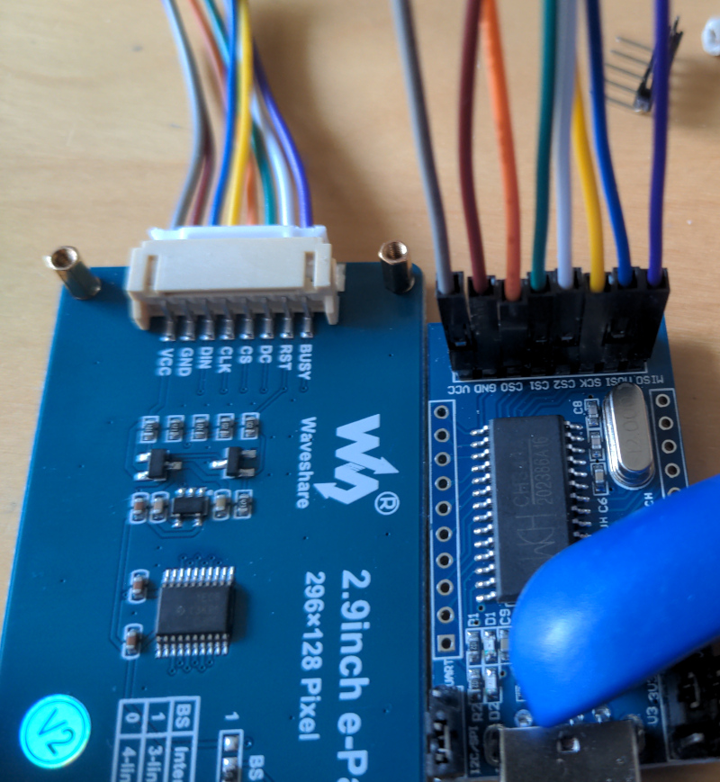

## epaper-nametag-programmer

### What is this?

This is a quick hack to program WaveShare 2.9inch e-Paper modules,
for use in reuseable nametags.

The idea is to quickly and temporarily attach the nametag to a PC with
an CH341 USB-to-SPI adapter (more specificly, a "Fasizi CH341A USB to
UART/IIC/SPI/TTL/ISP adapter" off Amazon), reprogram what it displays
with the software in this repo, and then deattach it until it is
reused with a different name.

This code is mainly based on two things:
* [Ch341Prog by Pluto Yang](https://github.com/setarcos/ch341prog), a really simple bitbanging example based on libusb (which means you do not have to install a kernel driver). `cht31a.c/h` are just taken completely unmodified from that project, so their original copyright applies.
* [The Arduino example code by WaveShare for the 2.9 inch e-Paper module](https://github.com/waveshare/e-Paper/tree/master/Arduino/epd2in9_V2)

### Cabling

| USB-to-SPI | e-Paper module | Color  |
| :--------: | :------------: | :----: |
| VCC        | VCC            | gray   |
| GND        | GND            | brown  |
| CS0        | CS             | orange |
| CS1        | DC             | green  |
| CS2        | RST            | white  |
| SCK        | CLK            | yellow |
| MOSI       | DIN            | blue   |
| MISO       | BUSY           | purple |

